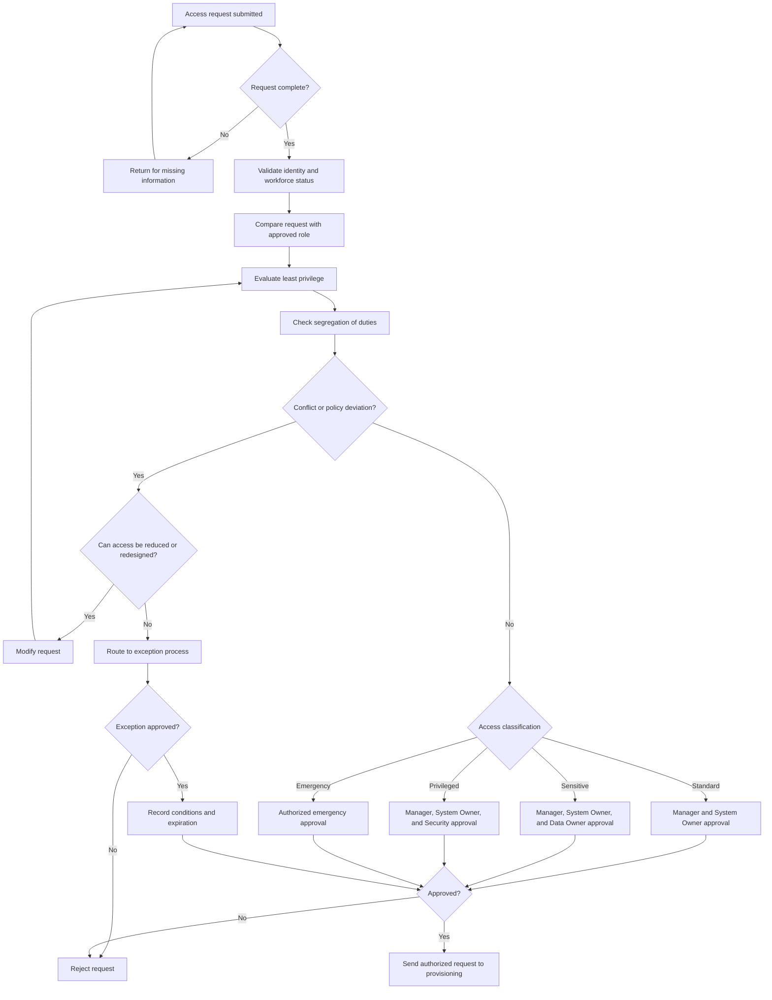

# Access Request and Approval Flow

## Purpose

This diagram shows how PLG evaluates standard, additional, temporary, privileged, emergency, and exceptional access requests.

---

## Approval Rules

| Access type | Minimum approval |
| --- | --- |
| Standard | Department Manager and System Owner |
| Sensitive | Manager, System Owner, and applicable Data Owner |
| Privileged | Manager, System Owner, and Security Lead |
| Emergency | Authorized security or incident authority |
| Exceptional | Authorized risk owner based on residual risk |

---

## Required Evidence

The flow should produce:

- Complete request
- Business justification
- Role comparison
- Least-privilege review
- SoD result
- Approvals
- Conditions
- Expiration
- Exception reference where applicable
- Final authorization
