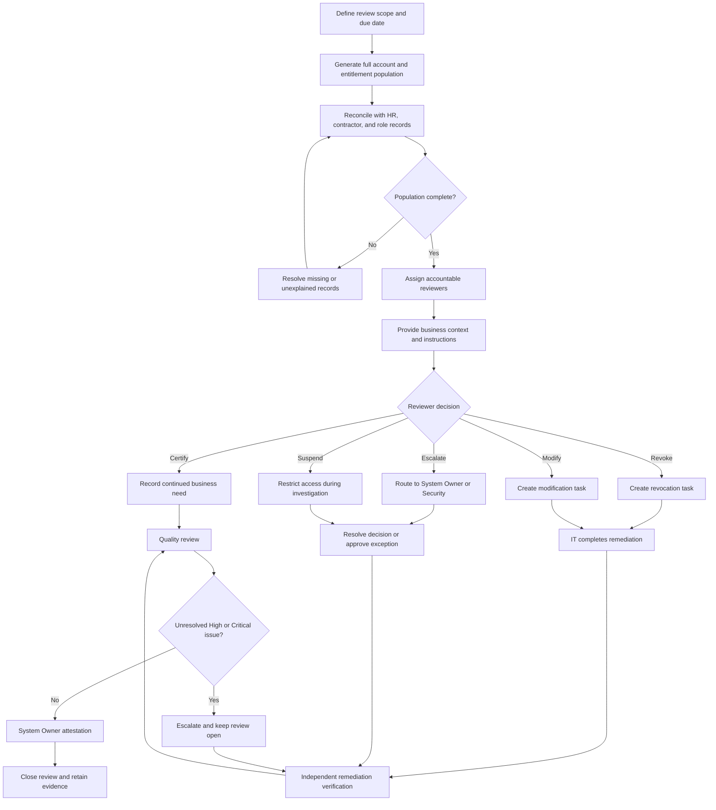

# Access Review and Remediation Flow

## Purpose

This diagram shows how PLG prepares, performs, remediates, verifies, and closes periodic access reviews.

---

## Quality Checks

Before closure, PLG confirms:

- The population was complete.
- Every account received a decision.
- Reviewers had sufficient context.
- Remediation was completed.
- Remediation was verified.
- Exceptions received approval.
- No unresolved High or Critical issue remained.
