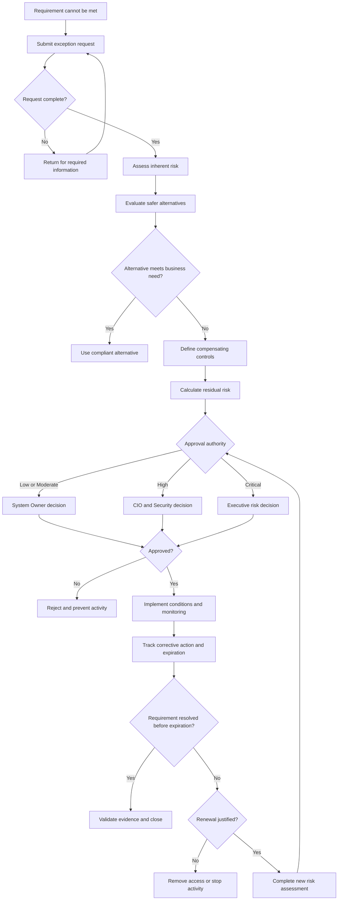

# Exception and Escalation Flow

## Purpose

This diagram shows how PLG evaluates a control deviation, determines approval authority, monitors the exception, and closes or escalates it.

---

## Escalation Levels

| Level | Example | Authority |
| --- | --- | --- |
| 1 | Isolated Low-impact process issue | Process Owner |
| 2 | Repeat Moderate issue or SLA breach | Manager and GRC |
| 3 | High-risk access or material control failure | CIO and Security Lead |
| 4 | Critical exposure or suspected misuse | COO and incident leadership |

---

## Prohibited Outcomes

The process must not allow:

- Open-ended exceptions
- Automatic renewal
- Requester self-approval
- Missing compensating controls
- Continued activity after expiration
- Closure without evidence
