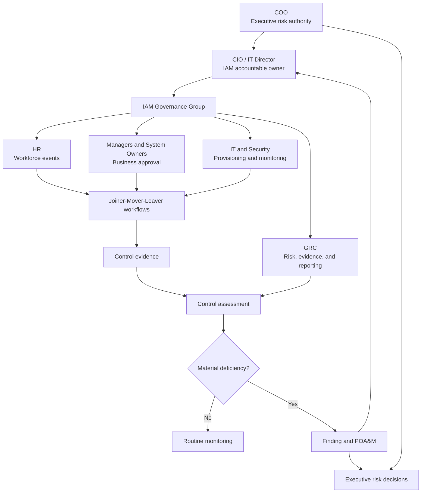

# IAM Governance Operating Model

## Purpose

This diagram shows how PLG assigns IAM governance, operational execution, assurance, and escalation responsibilities.

---

## Role Summary

| Governance layer | Roles | Primary responsibility |
| --- | --- | --- |
| Executive | COO | Critical risk and resource decisions |
| Accountable owner | CIO / IT Director | IAM program performance |
| Business authority | Managers and System Owners | Business need and entitlement approval |
| Authoritative source | HR and Contractor Sponsors | Workforce and relationship status |
| Control operation | IT, Security, and Facilities | Provisioning, monitoring, and removal |
| Oversight | GRC Analyst | Risk, evidence, metrics, exceptions, and remediation |
| Assurance | Assessor or Internal Audit | Independent evaluation |

---

## Decision Principle

The model separates:

- Business approval
- Technical implementation
- Verification
- Risk acceptance
- Independent assessment

One individual should not control every stage of a High-risk access decision.
