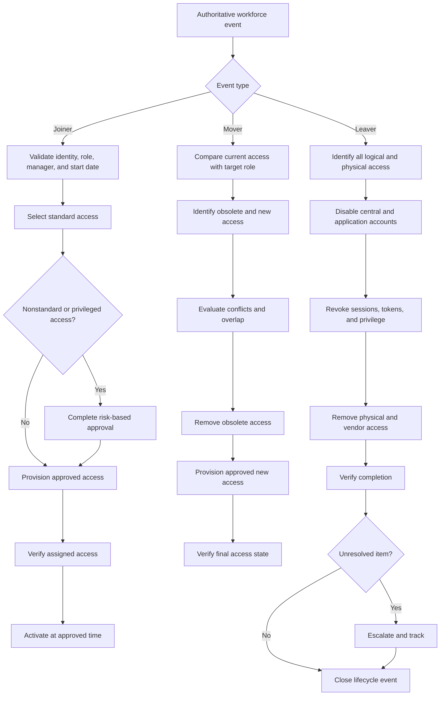

# Joiner-Mover-Leaver Process Flow

## Purpose

This diagram presents the end-to-end identity lifecycle defined by `WF-001`.

---

## Control Points

| Lifecycle stage | Primary control |
| --- | --- |
| Event initiation | Verified HR or sponsor event |
| Role selection | Approved role and entitlement catalog |
| Authorization | Manager and System Owner approval |
| Provisioning | Controlled technical work queue |
| Verification | Approved-versus-assigned comparison |
| Transfer | Current-versus-target access analysis |
| Termination | Time-based coordinated revocation |
| Closure | Evidence review and unresolved-item escalation |
