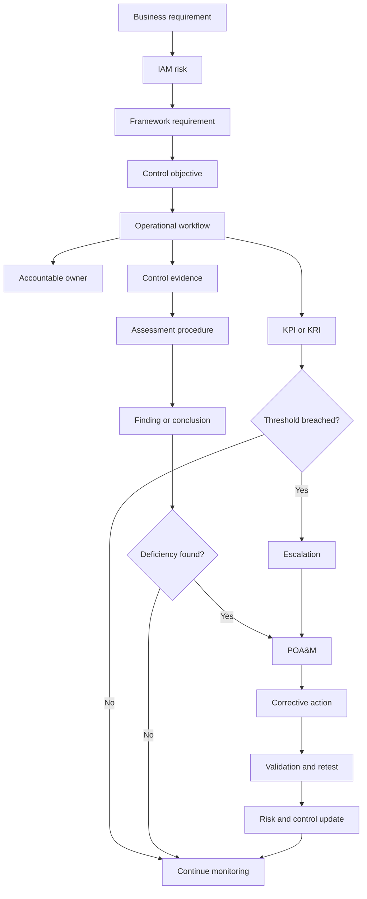

# Requirements-to-Workflow Traceability

## Purpose

This diagram shows how Project 3 connects governance requirements to operational performance and improvement.

---

## Traceability Example

| Layer | Example |
| --- | --- |
| Business requirement | Restrict system access to authorized personnel |
| Risk | `IAM-RISK-005` — Former personnel retain access |
| Framework requirement | `REQ-011` — Access removal following termination |
| Control objective | `CTRL-004` — Timely Access Removal |
| Workflow | `WF-006` — Termination and Emergency Revocation |
| Owner | HR Manager and IT Director |
| Evidence | `EVID-007` — Disablement and Revocation Record |
| Test | `TEST-003` — Termination Timeliness |
| Metric | `MET-003` — Termination completed within SLA |
| Finding | `FIND-001` — Vendor account remained active |
| Remediation | `POAM-001` — Add dependent application verification |

---

## Interpretation

Traceability prevents controls from existing as isolated documents.

Every selected requirement should connect to:

- A defined risk
- An operational control
- A workflow
- An accountable owner
- Evidence
- A test
- A metric
- A remediation path
